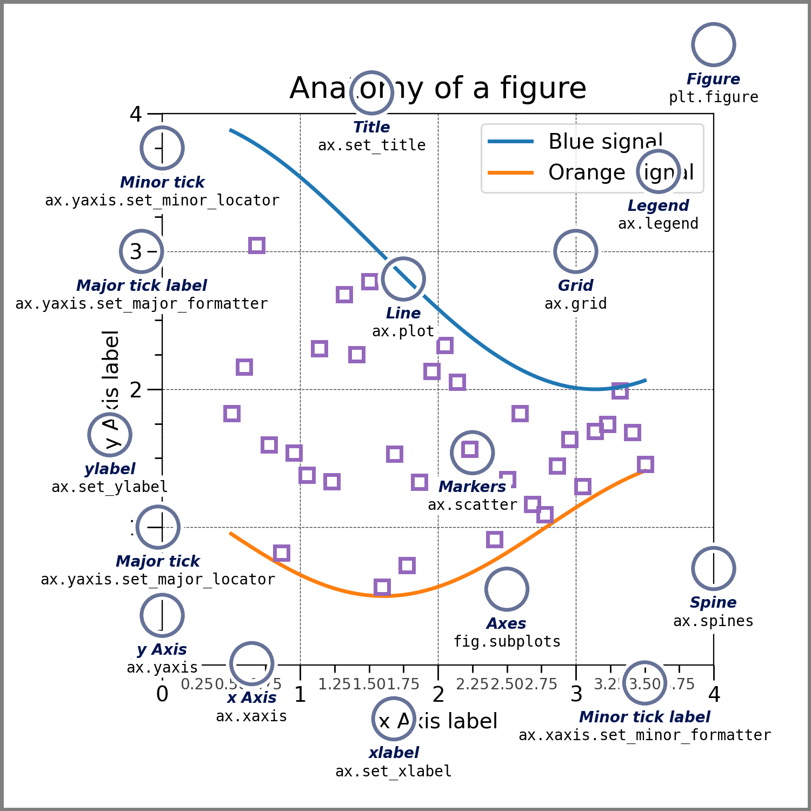

# Dasar Visualisasi dengan Python dan Jupyter

Visualisasi data dalam bentuk grafik memiliki peran penting dalam proses penelitian maupun penulisan makalah ilmiah. Penggunaan visualisasi untuk merepresentasikan data dan relasi antar variabel cenderung **lebih efektif** untuk menyampaikan ide dan hasil riset dibandingkan tulisan. Hal ini disebabkan oleh persepsi manusia yang lebih mudah memahami gambar dan *trend* dibandingkan dengan angka. Akan tetapi, sering kita jumpai bentuk visualisasi yang cenderung **membingungkan** atau bahkan **tidak sesuai** dengan sumber data.

## Python dan Jupyter

Python sebagai bahasa pemrograman tingkat tinggi sering digunakan untuk visualisasi data. Dua hal utama yang menjadi hal penting untuk Python adalah kemudahan penggunaan dan jumlah *open-source library* pendukung yang banyak. Workshop ini dapat diikuti baik secara luring dengan komputer pribadi, ataupun daring menggunakan [Google Colaboratory](https://colab.research.google.com/).

Untuk visualisasi kali ini, kita akan menggunakan `Jupyter` notebook yang dapat kalian jalankan menggunakan *web-interface* `JupyterLab` atau IDE seperti `Visual Studio Code`.

{: .catatan }
`JupyterLab` adalah penerus dan pengganti dari `Jupyter Notebook` klasik dengan beberapa fitur tambahan yang dapat berguna untuk pengguna lanjut.

## Matplotlib

Ada beberapa *library* visualisasi untuk Python yang umum digunakan. Pada workshop kali ini, kita akan menggunakan [Matplotlib](https://matplotlib.org/) sebagai *library* utama. Selain Matplotlib, [Mayavi](http://docs.enthought.com/mayavi/mayavi/) umumnya digunakan untuk visualisasi 3D dan [Plotly](https://plotly.com/) sering digunakan untuk visualisasi data yang lebih interaktif.

Matplotlib juga dapat digunakan secara bersamaan dengan LaTeX untuk penulisan teks di figur plot.

### Anatomi Figur Matplotlib



*Diambil dari [Matplotlib](https://matplotlib.org/stable/_images/anatomy.png).*

Anatomi dari figur Matplotlib dapat dibagi menjadi tiga objek utama:

1. **Figure**

    Komponen ini adalah dasar media (e.g. kertas) dari figur dan memiliki peran penting dalam proses penyimpanan dan pengaturan ukuran plot.

2. **Axes**

    Komponen ini adalah area plot. Terdapat 3 jenis proyeksi yang sering digunakan: Cartesian 2D (*default*), Polar, dan 3D. Satu **Figure** dapat memiliki beberapa **Axes** yang dapat diatur dengan beberapa cara.

    {: .peringatan }
    Visualisasi 3D sebaiknya dilakukan menggunakan [Paraview](https://www.paraview.org/) atau [Mayavi](http://docs.enthought.com/mayavi/mayavi/).

3. **Axis**

    Komponen ini merupakan bagian sumbu koordinat plot. Komponen ini biasanya digunakan untuk mengatur skala, label, dan interval dari nilai-nilai di sumbu plot.

4. **Artist**

    Komponen ini merupakan representasi dari objek plot seperti titik-titik, garis, atau teks.

Matplotlib menyediakan berbagai jenis *function* yang dapat digunakan untuk memodifikasi komponen dari tiga jenis objek yang telah disebutkan. Kemudahan modifikasi ini menjadi salah satu keunggulan dari Matplotlib, akan tetapi hal ini juga dapat menjadi salah satu kendala dalam pembuatan figur untuk publikasi.

### Penggunaan Matplotlib

Contoh penggunaan Matplotlib untuk membuat figur dapat dilihat di bawah ini.

```python
# Inisialisasi data untuk plotting
import matplotlib.pyplot as plt
import numpy as np

x = np.linspace(-np.pi, np.pi, 100)
y = np.sin(x)

fig, ax = plt.subplots()

# Atur label
ax.set_title('Fungsi')
ax.set_xlabel('x')
ax.set_ylabel('y')
```

Beberapa jenis figur yang umum digunakan adalah:

#### *Line Plot*

```python
ax.plot(x, y, 'r--', lw=2.)
```


#### *Scatter Plot*

```python
ax.scatter(x, y+2., c='b', marker='x', s=20., label='Menggunakan scatter')
ax.plot(x+0.5, y+2., 'g+', ms=5., label='Menggunakan plot')
ax.legend()
ax.set_yscale('log')
```


#### *Density/Contour Plot* Dua Dimensi

```python
fig, (ax, axcbar) = plt.subplots(
    ncols=2,
    gridspec_kw={'width_ratios': [1, 0.05],
                'wspace': 0.1}
)

X, Y = np.meshgrid(x, x)
Z = np.exp(-(X**2 + Y**2)/np.pi**2)

# Buat density plot
cntf_plot = ax.pcolormesh(X, Y, Z, vmin=0., vmax=1., cmap='plasma')
cbar = fig.colorbar(cntf_plot, cax=axcbar)

# Tambahkan garis kontur
cont_plot = ax.contour(X, Y, Z, colors='k', linewidths=0.5)

# Tambahkan label kontur
ax.clabel(cont_plot, inline=True, fontsize=8)

# Atur label
ax.set_title('Figur Kontur')
ax.set_xlabel('x')
ax.set_ylabel('y')
cbar.set_label('z')
```


#### *Histogram*

```python
fig, ax = plt.subplots()

rng = np.random.default_rng(0)
data = rng.logistic(13., 1., 10000)

counts, bins, _ = ax.hist(data, 100, density=True)

ax.set_xlabel('x')
ax.set_ylabel('PDF')
```


## Animasi dengan Matplotlib dan FFmpeg

Untuk keperluan visualisasi data dalam bentuk animasi, kita dapat menggunakan FFmpeg untuk menggabungkan hasil simpanan dari Matplotlib. Contoh pembuatan animasi figur sederhana dapat dilihat di bawah ini.

1. Buat serangkaian figur yang akan menjadi bahan animasi.

    ```python
    nx = 100
    x = np.linspace(0, 2*np.pi, nx)
    y = np.sin(x)

    fig, ax = plt.subplots()
    ax.set_xlabel('x')
    ax.set_ylabel('y')
    
    # Trajektori
    ax.plot(x, y, 'r--', lw=2.)

    for i in range(nx):
        # Plot titik benda
        obj_plot = ax.plot(x[i], y[i], 'bo', ms=5.)

        # Ganti judul
        ax.set_title(f't = {i}')

        # Simpan figur
        fig.savefig(f'animasi_{i:03d}.png')

        # Hapus titik
        obj_plot.pop().remove()
    ```

2. Gabungkan figur dengan menggunakan FFmpeg.

    Untuk membuat video 24 fps yang menggunakan 10 figur per detik, kita dapat menggunakan perintah berikut:

    ```bash
    ffmpeg \
    -y \
    -r 10 \
    -i ./animasi_%03d.png \
    -c:v libx264 \
    -vf "pad=ceil(iw/2)*2:ceil(ih/2)*2,fps=24,format=yuv420p" \
    animasi.mp4
    ```

    {: .catatan }
    Fungsi parameter `pad=ceil(iw/2)*2:ceil(ih/2)*2` adalah untuk memastikan resolusi gambar memiliki nilai yang genap. Hal ini diperlukan karena proses kompresi video umumnya membutuhkan resolusi video yang genap.

    {: .catatan }
    Perintah `bash` dapat dijalankan di Jupyter Notebook dengan menambahkan `!` di awal perintah, misalnya `!ls`.
