# Kolaborasi Riset dengan Git

## *Version Control* dalam Kolaborasi

Dalam proses riset yang melibatkan **banyak orang**, sering kali kita mengalami kesulitan dalam **mengelola file** yang kita kerjakan. Oleh karena itu, penggunaan *version control* secara natural memiliki peran penting dalam proses kolaborasi.

Selama ini kita mungkin sudah melakukan *version control* secara tidak langsung dengan penamaan file atau penyimpanan di surel. Dalam ***online editor***, seperti Google Docs atau Overleaf, proses *version control* juga sudah terintegrasi secara langsung dalam bentuk **Version History** yang sering kita gunakan.

Berbeda dari *online editor* yang memungkinkan kolaborasi ***real time***, **Git** sebagai *version control* hanya bisa melakukan proses pembaharuan secara bertahap dalam tingkat file secara bertahap.

Meskipun kita tidak dapat mengubah file secara bersamaan dengan kolaborator kita, dua peneliti masih dapat mengedit file secara terpisah dan melakukan proses ***Merge*** untuk menggabungkan hasil kerja mereka. Ini adalah buntut dari sifat Git yang **terdistribusi**, di mana masing-masing kolaborator memiliki salinan *repo* secara mandiri.

Dengan menggunakan pendekatan ini, kita dapat menghindari masalah **perubahan file lain oleh kolaborator** yang dapat mempengaruhi hal yang sedang kita kerjakan.

Ada beberapa alur kerja yang dapat kita lakukan dengan menggunakan sistem Git. Pada sesi kali ini, kita akan fokus dalam alur penggunaan Git dengan basis ***feature branch***.

## *Merging Branch*

Dalam proses kolaborasi, kita tidak dapat menghindari kenyataan bahwa pada suatu waktu histori *commit* kita akan **bercabang**.



Untuk melakukan proses **Merge**, kita dapat menggunakan perintah:

```bash
git checkout [BRANCH TUJUAN MERGE]
git merge [BRANCH YANG AKAN DIMERGE]
```

Kita akan membahas lebih lanjut proses *merging* dalam [Latihan 2](/workshop_2/latihan_2.html).

## *Pull Request*

***Pull request*** adalah salah satu fitur **GitHub** yang dapat kita gunakan untuk manajemen proses *merging*. Fitur ini memungkinkan proses *review* secara eksplisit sebelum sebuah proses *merge* dilakukan antara dua *branch*.

Pada umumnya, hanya sebagian kecil pengguna yang memiliki **akses penulisan** langsung ke *branch* utama. Hal ini dilakukan untuk mengurangi resiko penulisan kode yang tidak sesuai dengan standar yang ditetapkan.

Fitur *pull request* memungkinkan perubahan kode yang akan di*merge* untuk dilihat dan disetujui oleh pengawas *repo* sebelum diproses. Fitur ini juga memungkinkan penambahan komentar dan diskusi terhadap perubahan kode yang diajukan.

## *Feature Branch*



***Feature branch*** adalah metode penggunaan Git yang memanfaatkan *branch* berbeda untuk masing-masing fitur yang sedang dikembangkan.

Misalnya dalam penelitian, satu peneliti dapat bertanggung jawab terhadap program pengolah data sedangkan peneliti lain dapat bertanggung jawab dalam program untuk analisa. Dengan menggunakan konsep ini, masing-masing peneliti bekerja di dalam *branch* yang **berbeda-beda** yang bercabang dari *branch* utama (*main* atau *master*). Saat program keseluruhan ingin diperbarui, fitur yang sudah selesai dapat digabungkan dengan *branch* utama melalui proses *merge*.

Konsep ini mendorong **modularisasi** proses penelitian dan **mengurangi kebutuhan *merging*** yang rawan kesalahan.

## Privatisasi *Repository*

Sering kali saat kita ingin bekerja dengan orang lain, kita **tidak ingin agar apa yang kita kerjakan bersifat publik**.

**GitHub** sendiri memiliki konsep ***Fork*** di mana kita dapat membuat salinan *repo* terpisah. Salinan ini dapat kita kelola secara mandiri yang memungkinkan kita untuk melakukan *commit* atau modifikasi lainnya tanpa membutuhkan *permission* dari *repo* utama. Akan tetapi, hasil *forked repo* hanya bisa dilakukan untuk *repo* publik dan hasil *repo* juga harus publik.

{: .catatan }
Konsep *Fork* bukanlah konsep dari Git.

Untuk kepentingan privasi ini, kita akan membahas penggunaan beberapa ***remote locations*** untuk satu *repo*.

Dengan cara ini dan sistem [*Feature Branch*](#feature-branch), kita dapat bekerja sama tanpa harus khawatir tentang hasil kerja sementara kita terlihat oleh orang lain.

Tahapan kerja untuk hal ini dapat dilihat di [Latihan 2](/workshop_2/latihan_2.html).
