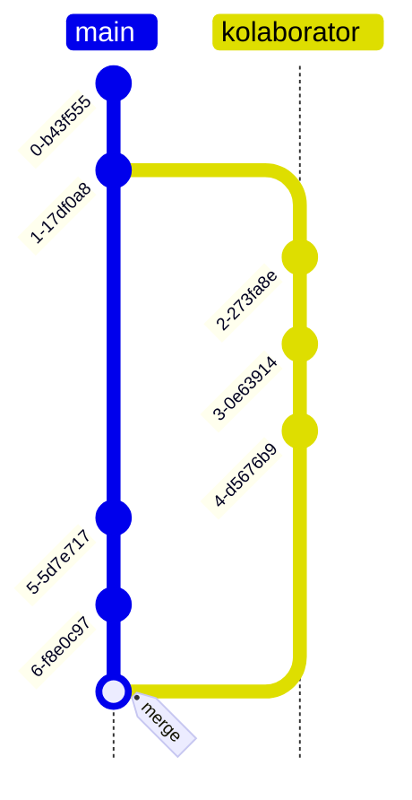

# Kolaborasi Riset dengan Git

## *Version Control* dalam Kolaborasi

Dalam proses riset yang melibatkan **banyak orang**, sering kali kita mengalami kesulitan dalam **mengelola file** yang kita kerjakan. Oleh karena itu, penggunaan *version control* secara natural memiliki peran penting dalam proses kolaborasi.

Selama ini kita mungkin sudah melakukan *version control* secara tidak langsung dengan penamaan file atau penyimpanan di surel. Dalam ***online editor***, seperti Google Docs atau Overleaf, proses *version control* juga sudah terintegrasi secara langsung dalam bentuk **Version History** yang sering kita gunakan.

Berbeda dari *online editor* yang memungkinkan kolaborasi ***real time***, **Git** sebagai *version control* hanya bisa melakukan proses pembaharuan secara bertahap dalam tingkat file secara bertahap.

Meskipun kita tidak dapat mengubah file secara bersamaan dengan kolaborator kita, dua peneliti masih dapat mengedit file secara terpisah dan melakukan proses ***Merge*** untuk menggabungkan hasil kerja mereka. Ini adalah buntut dari sifat Git yang **terdistribusi**, di mana masing-masing kolaborator memiliki salinan *repo* secara mandiri.

Dengan menggunakan pendekatan ini, kita dapat menghindari masalah **perubahan file lain oleh kolaborator** yang dapat mempengaruhi hal yang sedang kita kerjakan.

Ada beberapa alur kerja yang dapat kita lakukan dengan menggunakan sistem Git. Pada sesi kali ini, kita akan fokus dalam alur penggunaan Git dengan basis ***feature branch***.

## *Merging Branch*

Dalam proses kolaborasi, kita tidak dapat menghindari kenyataan bahwa pada suatu waktu histori *commit* kita akan **bercabang**.

Untuk hal ini ada beberapa cara yang dapat kita gunakan untuk meluruskan histori file di Git. Kita akan membahas lebih lanjut proses *merging* dalam HIMA:LATIHAN 2.

## *Pull Request*

*Pull request* adalah salah satu fitur GitHub yang sangat berguna untuk kolaborasi. Fitur ini berfungsi untuk melakukan *review* secara eksplisit terhadap proses *merge* dari dua *branch* yang berbeda. Beberapa pengguna yang ditunjuk sebagai pengawas *repo* dapat melakukan pengecekan terhadap kode-kode yang akan digabungkan dengan *branch* utama. Dalam penggunaan fitur ini, biasanya *branch* utama hanya akan dapat diakses oleh beberapa orang saja. Hal ini mengurangi resiko penulisan kode yang tidak sesuai dengan standar yang ditetapkan.

HIMA:

## *Feature Branch*

*Feature branch* adalah metode penggunaan Git yang memanfaatkan *branch* untuk mengelola subset file berkaitan dengan suatu fitur tertentu. Misalnya dalam penelitian, satu peneliti dapat bertanggung jawab terhadap program pengolah data sedangkan peneliti lain dapat bertanggung jawab dalam program untuk analisa. Dengan menggunakan konsep ini, masing-masing peneliti membuat *branch* yang berbeda dari *branch* utama (*main* atau *master*). Seluruh perubahan yang dilakukan akan kemudian disimpan dalam *branch* masing-masing. Saat program keseluruhan ingin dijalankan, fitur yang sudah selesai dapat digabungkan dengan *branch* utama.

Konsep ini juga mendorong modularisasi proses penelitian dan mengurangi kebutuhan untuk *merging* yang rawan kesalahan.

## Privatisasi *Repository*

Sering kali saat kita ingin bekerja dengan orang lain, kita tidak ingin agar apa yang kita kerjakan selalu terlihat oleh orang lain. GitHub sendiri memiliki konsep ***Fork*** di mana kita dapat membuat *repo* terpisah dari *repo* utama yang terhubung secara tidak langsung di platform GitHub. Akan tetapi, konsep *Fork* bukanlah konsep dari Git dan memiliki kelemahan bahwa *repo* yang dihasilkan tidak bisa bersifat privat.

Untuk hal ini kita dapat menggunakan *repo* privat yang ditambahkan sebagai *remote* kedua dari local *repo* yang kita kerjakan. Dengan cara ini dan sistem [*Feature Branch*](#feature-branch), kita dapat bekerja sama tanpa harus khawatir tentang hasil kerja sementara kita terlihat oleh orang lain.

Tahapan kerja untuk hal ini dapat dilihat di HIMA:LATIHAN 2.
