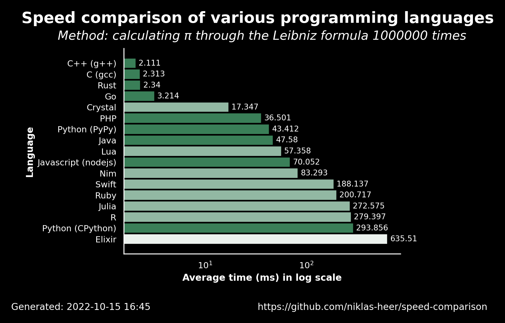

# Just-in-time (JIT) Compiler untuk Python

Python sebagai bahasa pemrograman tingkat tinggi memiliki keunggulan dibandingkan bahasa pemrograman lainnya, yaitu mudah dipelajari dan mudah diimplementasikan. Namun, hal ini juga menyebabkan Python memiliki kelemahan dibandingkan bahasa pemrograman tingkat rendah seperti Fortran dan C++ yaitu kecepatan eksekusi program.



## JIT Compiler

Salah satu cara untuk mengatasi masalah lambatnya eksekusi kode adalah dengan menggunakan *just-in-time (JIT) compiler*. *JIT compiler* akan mengubah kode Python menjadi *machine code* yang dapat dijalankan lebih cepat. Dalam workshop ini, kita akan menggunakan *library* [Numba](https://numba.pydata.org/). Selain Numba, ada beberapa *library* lain yang dapat digunakan untuk melakukan JIT, misalnya [PyPy](https://www.pypy.org/).

## Numba

Numba adalah *library JIT compiler* yang dikembangkan oleh Anaconda. Dibanding Cython, Numba lebih mudah digunakan karena tidak memerlukan *type annotation* secara eksplisit. Numba juga dapat digunakan untuk melakukan paralelisasi kode Python yang akan kita pelajari lebih lanjut pada sesi selanjutnya.

Penggunaan Numba untuk kompilasi instan dapat dilakukan dengan menambahkan dekorator fungsi `@jit(nopython=True)` atau `@njit` sebelum definisi fungsi. Contoh penggunaan Numba untuk menghitung nilai integral sederhana dapat dilihat pada kode berikut.

```python
import numpy as np
from numba import jit

@jit(nopython=True)
def integral(f, a, b, N):
    x = np.linspace(a, b, N)
    dx = x[1] - x[0]
    return np.sum(f(x)) * dx
```

Opsi `nopython=True` digunakan untuk memastikan bahwa Numba akan mengubah kode Python menjadi *machine code*. Jika opsi ini tidak digunakan, Numba akan mengubah kode Python dalam [*object mode*](https://numba.pydata.org/numba-doc/latest/glossary.html#term-object-mode) yang menggunakan Python C API dan seringkali tidak menghasilkan peningkatan kecepatan yang signifikan.

Adapun keterbatasan utama dari penggunaan Numba adalah minimnya kemampuan untuk menggunakan bentuk data yang lebih kompleks. *Array* yang ditransformasi oleh Numba harus berupa *array* NumPy dengan tipe data yang sederhana seperti `float` atau `int`. Numba juga tidak dapat digunakan untuk mengubah kode Python yang menggunakan *library* yang tidak didukung seperti `scipy`.

Dalam contoh di atas, fungsi Numba `integral` memiliki input berbentuk fungsi untuk variabel `f`. Fungsi ini juga harus sebelumnya diubah menjadi *machine code* menggunakan Numba. Numba juga secara otomatis melakukan vektorisasi dan optimasi kode, [setara dengan `-O3` pada GCC](https://stackoverflow.com/questions/36526708/comparing-python-numpy-numba-and-c-for-matrix-multiplication).

Pada waktu fungsi pertama kali dipanggil, Numba akan melakukan kompilasi instan dan menyimpan hasilnya dalam *cache*. Hal ini penambahan waktu yang dibutuhkan untuk kali pertama penggunaan fungsi. Salah satu cara untuk memitigasi hal ini adalah dengan menggunakan opsi `cache=True` pada dekorator Numba untuk menyimpan hasil kompilasi instan dalam file sehingga dapat digunakan kembali pada waktu selanjutnya.

## Penggunaan JIT di Fisika

JIT dalam penelitian Fisika biasanya digunakan dalam proses *post-processing* data berskala besar yang membutuhkan waktu eksekusi yang lama. Selain itu JIT juga dapat digunakan untuk melakukan simulasi numerik dengan skala kecil sampai menengah. Bergantung pada skala simulasi yang diinginkan, penggunaan kode Python dengan JIT dapat menghemat waktu untuk menulis kode dibandingkan dengan penggunaan C++ atau Fortran. Kita akan membahas secara lebih lanjut penggunaan JIT untuk simulasi sederhana Fisika pada [Latihan 4A](../latihan_4A.md).
